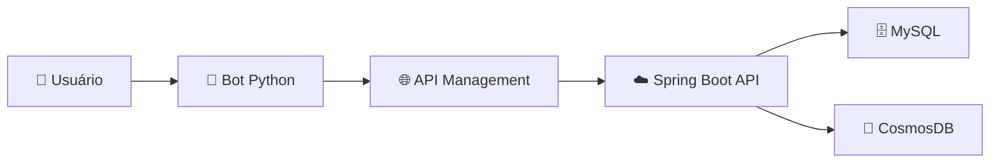

# 🛍️ IBMEC MALL - Chatbot E-commerce

> 🤖 Bot inteligente para e-commerce com **Microsoft Bot Framework** integrado à **API REST** no Azure

[](https://python.org)
[](https://dev.botframework.com/)
[](https://azure.microsoft.com)

## ✨ **Funcionalidades**

- 🔍 **Consultar Produtos** - Buscar e visualizar catálogo completo
- 🛒 **Realizar Compras** - Processo de compra seguro com cartão
- 📦 **Consultar Pedidos** - Histórico completo de pedidos
- 💳 **Extrato de Compras** - Relatório detalhado de transações

---

## 🚀 **Setup Rápido (3 minutos)**

### **1. Fork este repositório**
👆 Clique no botão **"Fork"** no topo desta página para criar sua cópia

### **2. Clone SEU fork**
```bash
# Substitua SEU-USUARIO pelo seu username do GitHub
git clone https://github.com/SEU-USUARIO/ibmec-ecommerce-chatbot.git
cd ibmec-ecommerce-chatbot
```

### **3. Execute o setup automático**
```bash
python setup.py
```

### **4. Ative o ambiente virtual**
```bash
# Windows:
venv\Scripts\activate

# Mac/Linux:
source venv/bin/activate
```

### **5. Execute o bot**
```bash
python run_local.py
```

### **6. Teste no Bot Framework Emulator**
- 📥 **Download**: [Bot Framework Emulator](https://github.com/Microsoft/BotFramework-Emulator/releases)
- 🔗 **URL**: `http://localhost:3978/api/messages`
- 🆔 **App ID**: (deixe vazio)
- 🔑 **App Password**: (deixe vazio)

---

## 🎮 **Como Usar**

1. **💬 Inicie conversa**: Digite `"olá"`
2. **🔍 Explore produtos**: Escolha "Consultar Produtos"
3. **🛒 Faça compra**: Clique "Comprar" em qualquer produto
4. **📊 Veja extrato**: Use "Extrato de Compras"

### **🎯 Exemplo de Teste Completo:**
```
Usuário: olá
Bot: [Menu principal]
Usuário: [Clica "Consultar Produtos"]
Usuário: todos
Bot: [Mostra produtos com botões "Comprar"]
Usuário: [Clica "Comprar Notebook"]
Bot: [Processo de compra - pede dados do cartão]
Usuário: [Completa compra]
Bot: ✅ Compra realizada!
Usuário: [Volta ao menu, escolhe "Extrato"]
Bot: [Mostra histórico da compra]
```

---

## 🏗️ **Arquitetura**



---

## 📋 **Pré-requisitos**

- 🐍 **Python 3.8+** - [Download](https://python.org/downloads/)
- 🔧 **Git** - [Download](https://git-scm.com/downloads)
- 🌐 **Conexão com internet** (para acessar API no Azure)

---

## ⚠️ **Resolução de Problemas**

<details>
<summary>🔧 <strong>Problemas Comuns</strong></summary>

### ❌ "python: command not found"
```bash
# Instale Python 3.8+ em python.org
# Ou tente:
python3 setup.py
```

### ❌ "ModuleNotFoundError"
```bash
# Reinstale dependências:
pip install -r requirements.txt --force-reinstall
```

### ❌ "Port 3978 already in use"
```bash
# Mude a porta no arquivo .env:
PORT=3979
```

### ❌ "API connection failed"
```bash
# Teste se a API está online:
curl https://ibmec-ecommerce-app-gydeg9hye0eabpbf.brazilsouth-01.azurewebsites.net/products
# Se não funcionar, a API pode estar offline
```

### ❌ "Permission denied" (Mac/Linux)
```bash
chmod +x setup.py
python setup.py
```

</details>

<details>
<summary>🏥 <strong>Setup Manual (se automático falhar)</strong></summary>

```bash
# 1. Criar ambiente virtual
python -m venv venv

# 2. Ativar ambiente
# Windows:
venv\Scripts\activate
# Mac/Linux:
source venv/bin/activate

# 3. Instalar dependências
pip install -r requirements.txt

# 4. Criar arquivo .env
echo "URL_PREFIX=https://ibmec-ecommerce-app-gydeg9hye0eabpbf.brazilsouth-01.azurewebsites.net" > .env
echo "PORT=3978" >> .env

# 5. Executar
python run_local.py
```

</details>

---

## 📁 **Estrutura do Projeto**

```
📦 ibmec-ecommerce-chatbot
├── 🤖 api/                 # Cliente da API REST
├── 🧠 bots/                # Lógica principal do bot  
├── 💬 dialogs/             # Fluxos de conversa
│   ├── main_dialog.py      # Menu principal
│   ├── consultar_produtos_dialog.py
│   ├── consultar_pedidos_dialog.py
│   ├── extrato_compra_dialog.py
│   └── comprar_produto_dialog.py
├── 🔧 helpers/             # Utilitários
├── 📊 models/              # Modelos de dados
├── ⚙️ app.py               # Aplicação principal
├── 🔐 config.py            # Configurações
├── 🚀 setup.py             # Setup automático
├── 🏃 run_local.py         # Script de execução
└── 📋 requirements.txt     # Dependências
```

---

## 🛠️ **Desenvolvimento**

### **🔄 Para contribuir:**

1. **Fork** este repositório
2. **Clone** seu fork
3. **Crie branch**: `git checkout -b minha-feature`
4. **Desenvolva** sua feature
5. **Commit**: `git commit -m "feat: nova funcionalidade"`
6. **Push**: `git push origin minha-feature`
7. **Pull Request** para este repositório

### **🧪 Para testar mudanças:**
```bash
# Reiniciar bot após mudanças
python run_local.py
```

### **📝 Para adicionar nova funcionalidade:**
1. Crie novo dialog em `dialogs/`
2. Adicione no `main_dialog.py`
3. Teste no Bot Framework Emulator

---

## 🌐 **API Endpoints Disponíveis**

| Método | Endpoint | Descrição |
|--------|----------|-----------|
| `GET` | `/products` | 📋 Listar todos os produtos |
| `GET` | `/products/search?productName=x` | 🔍 Buscar produtos por nome |
| `POST` | `/orders` | 🛒 Criar novo pedido |
| `GET` | `/orders/user/{id}` | 📦 Pedidos de um usuário |
| `GET` | `/users/{id}/credit-card/{cardId}/statement` | 💳 Extrato do cartão |

---

## 🎓 **Sobre o Projeto**

Este chatbot foi desenvolvido como projeto prático do curso de **Cloud Computing da IBMEC**, demonstrando:

- ✅ **Integração** com APIs REST
- ✅ **Deploy** em nuvem (Azure)
- ✅ **Arquitetura** de microsserviços
- ✅ **Interface** conversacional
- ✅ **Boas práticas** de desenvolvimento

---

## 📞 **Suporte**

- 🐛 **Bugs**: Abra uma [Issue](../../issues)
- 💡 **Ideias**: Use [Discussions](../../discussions)
- 📖 **Docs**: [Microsoft Bot Framework](https://docs.microsoft.com/azure/bot-service/)

---

## 📄 **Licença**

Este projeto é desenvolvido para fins **educacionais** como parte do curso de Cloud Computing da IBMEC.

---

<div align="center">

**🎯 Desenvolvido com ❤️ por estudantes da IBMEC**

[⭐ Star este repo](../../stargazers) • [🍴 Fork](../../fork) • [📝 Issues](../../issues)

</div>